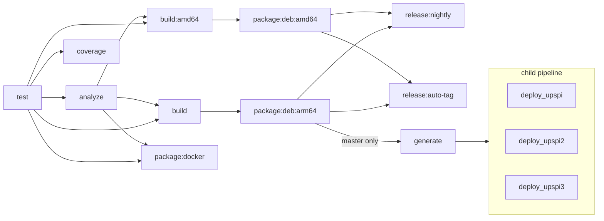

# Deployment

airies-ups is distributed to the Raspberry Pis as a Debian package (`.deb`) built in CI and pushed via `apt-get install`. The Pi needs no build tools — just the runtime libraries that the package's `Depends:` field resolves automatically.

The frontend (React/Vite) and SQL migrations are embedded into the daemon binary at build time. A single binary serves the API, web UI, and manages its own schema with no external files needed beyond `config.yaml` and the SQLite database — both of which the `.deb` plants in `/var/lib/airies-ups/`.

## Targets

| Name | Host | UPS | Web UI |
|------|------|-----|--------|
| upspi | `sysadmin@upspi.internal.airies.net` | APC SRT (Modbus RTU) | `http://upspi.internal.airies.net:8080` |
| upspi2 | `sysadmin@upspi2.internal.airies.net` | APC Back-UPS ES 600M1 (USB HID) | `http://upspi2.internal.airies.net:8080` |
| upspi3 | `sysadmin@upspi3.internal.airies.net` | APC SMT1500RM2UC (Modbus RTU) | `http://upspi3.internal.airies.net:8080` |

## Prerequisites

**Dev machine** — cross-compilation toolchain and frontend build:

```
aarch64-unknown-linux-gnu-gcc    # Gentoo crossdev: sudo crossdev -t aarch64-unknown-linux-gnu
bun brotli gzip xxd
```

**Pi** — nothing pre-installed. The `.deb`'s `Depends:` field pulls runtime libraries from trixie's main repo on first install:

```
libmodbus5 libsqlite3-0 libcurl4t64 libmicrohttpd12t64 libssl3t64
```

**Sysroot** — library headers and `.so` files synced from the Pi to `~/.sysroot/aarch64/`:

```bash
# Headers
rsync -az pi:/usr/include/modbus/ ~/.sysroot/aarch64/usr/include/modbus/
rsync -az pi:/usr/include/sqlite3.h pi:/usr/include/sqlite3ext.h ~/.sysroot/aarch64/usr/include/
rsync -az pi:/usr/include/microhttpd.h ~/.sysroot/aarch64/usr/include/
rsync -az pi:/usr/include/openssl/ ~/.sysroot/aarch64/usr/include/openssl/
rsync -az pi:/usr/include/aarch64-linux-gnu/curl/ ~/.sysroot/aarch64/usr/include/curl/
rsync -az pi:/usr/include/aarch64-linux-gnu/openssl/ ~/.sysroot/aarch64/usr/include/openssl/

# Libraries (follow symlinks to get real .so files)
rsync -azL pi:/usr/lib/aarch64-linux-gnu/lib{modbus,sqlite3,curl,microhttpd,crypto}.so ~/.sysroot/aarch64/usr/lib/
```

The sysroot only needs refreshing on a Debian major version upgrade (e.g. bookworm → trixie). Patch updates within a release don't change the ABI.

**USB HID**: the `.deb` ships `99-airies-ups-ftdi.rules` to `/usr/lib/udev/rules.d/` and joins the `airies-ups` system user to `dialout` (Modbus FTDI) + `plugdev` (USB HID) automatically — no manual udev setup needed for installed Pis. For dev-machine local runs, the rule's still in the repo at `99-airies-ups-ftdi.rules`.

## Build pipeline

### `make all` — native release build

```
frontend          → bun install && bun run build (Vite bundle)
frontend-test     → vitest run (221 tests)
embed-frontend    → gzip + brotli compress, xxd into C byte arrays
embed-migrations  → embed_sql.sh converts migrations/*.sql into C arrays
test              → C unit tests (cmocka)
_build            → gcc release binary with embedded frontend + migrations
```

### `make cross` — cross-compile for aarch64 (used by deploy)

Same pipeline as `make all` for frontend + tests + embedding, then:

```
c-utils           → cross-compile with aarch64-unknown-linux-gnu-gcc
airies-ups        → cross-compile and link against sysroot libraries
```

Tests run natively before the cross-compile step — if tests fail, the cross build never starts.

### `make debug` — development build

Skips frontend embedding. Serves files from `frontend/dist/` on disk for Vite dev server hot-reload.

### Shared details

The frontend embed step generates `build/embedded_assets.c` containing raw, gzip, and brotli variants of each frontend file. The HTTP server does content negotiation at serve time — clients that accept brotli or gzip get pre-compressed responses with zero runtime compression cost.

The migration embed step generates `build/migrations_compiled.c` from the `migrations/` directory using c-utils' `embed_sql.sh`. The SQL files remain the source of truth — the generated C file is a build artifact.

## Quick deploy

The primary deploy path is GitLab CI. Every master push:

1. Builds the `arm64` `.deb` (`package:deb:arm64`)
2. Publishes it as the rolling `nightly` release (`release:nightly`)
3. Fans out to each host in `$UPS_DEPLOY_HOSTS` via the dynamic child pipeline — `scp` the `.deb` and `apt-get install` it. The package's `postinst` restarts the service.

For native dev work without a Pi:

```bash
./deploy.sh local        # native debug build → ~/.local/share/airies-ups
```

For the one-time conversion of an existing Pi from the legacy `/home/sysadmin/airies-ups` rsync-binary layout to the `.deb` layout, see [First-time setup](#first-time-setup) below.

## What gets deployed

The arm64 `.deb` (~410 KB) lays out the FHS-conventional way:

```
/usr/bin/airies-upsd                        daemon
/usr/bin/airies-ups                         CLI
/usr/lib/systemd/system/airies-ups.service  systemd unit (enabled by postinst)
/usr/lib/udev/rules.d/99-airies-ups-ftdi.rules  FTDI Modbus rule
/var/lib/airies-ups/                        state (config.yaml, app.db, owned airies-ups:airies-ups 0750)
```

The package creates an `airies-ups` system user (in `dialout` + `plugdev`), no human shell. The service runs as that user. Frontend assets and SQL migrations are embedded into the daemon binary itself — no separate asset directory on disk.

## Pre-deploy verification

Run the full analysis and lint suite before deploying:

```bash
# Full build pipeline (frontend + tests + embed + C tests + release binary)
make all

# C: compile check, stack usage, gcc-fanalyzer, cppcheck
make analyze

# C: clang-tidy
make lint
```

## Runtime layout

```
/usr/bin/airies-upsd       # daemon (frontend + migrations embedded)
/usr/bin/airies-ups        # CLI
/var/lib/airies-ups/
  config.yaml              # bootstrap config (managed by setup wizard)
  app.db                   # SQLite database (created on first run)
```

The systemd unit pins `AIRIES_UPS_CONFIG_PATH=/var/lib/airies-ups/config.yaml` via `Environment=` so the daemon's c-utils config layer resolves the file from the state dir, not CWD. `db.path` defaults to `app.db` (CWD-relative); `WorkingDirectory=/var/lib/airies-ups` lands it next to the config.

## Configuration

`config.yaml` is the bootstrap config (needed before DB starts). UPS connection details are configured through the web UI setup wizard on first run.

Serial (Modbus RTU):
```yaml
db:
  path: app.db
ups:
  conn_type: serial
  device: /dev/ttyUSB0
  baud: 9600
  slave_id: 1
http:
  port: 8080
  socket: /tmp/airies-ups.sock
pushover:
  token:
  user:
```

USB (HID):
```yaml
db:
  path: app.db
ups:
  conn_type: usb
  usb_vid: 051d
  usb_pid: 0002
http:
  port: 8080
  socket: /tmp/airies-ups.sock
pushover:
  token:
  user:
```

Runtime settings (poll intervals, alert thresholds, shutdown config, weather, etc.) are stored in the database and configurable via the web UI. Changes auto-restart the daemon.

## Service management

```bash
# Status
ssh sysadmin@upspi.internal.airies.net "systemctl status airies-ups"

# Logs (follow)
ssh sysadmin@upspi.internal.airies.net "journalctl -u airies-ups -f"

# Restart
ssh sysadmin@upspi.internal.airies.net "sudo systemctl restart airies-ups"
```

Replace `upspi` with `upspi2` for the second target.

## First-time setup

For a Pi (or any trixie host) that's never had airies-ups installed:

```bash
ARCH=$(ssh sysadmin@<host> dpkg --print-architecture)
curl -fLO "https://git.airies.net/api/v4/projects/233/packages/generic/airies-ups/nightly/airies-ups_${ARCH}.deb"
scp "airies-ups_${ARCH}.deb" "sysadmin@<host>:/tmp/"
ssh sysadmin@<host> "sudo apt-get install -y /tmp/airies-ups_${ARCH}.deb"
```

Open `http://<host>:8080` — the setup wizard guides you through admin password, UPS detection, and optional Pushover.

After the host is registered with `$UPS_DEPLOY_HOSTS`, subsequent deploys flow through master pipelines automatically.

## Local development

Run the daemon and frontend locally for development and testing without a Pi.

### Prerequisites

Native versions of the same libraries the Pi uses:

```
libmodbus-dev libsqlite3-dev libcurl4-openssl-dev libmicrohttpd-dev libssl-dev
bun
```

c-utils must be built natively (not cross-compiled):

```bash
make -C ../c-utils clean && make -C ../c-utils
```

### Local install directory

The local dev environment lives at `~/.local/share/airies-ups`. Build and deploy with:

```bash
./deploy.sh local
```

This runs a native debug build and copies the binaries to the install directory.

On first setup, create a minimal `config.yaml` — set `conn_type` to match your UPS:

```bash
cat > ~/.local/share/airies-ups/config.yaml << 'EOF'
db:
  path: app.db
ups:
  conn_type: usb
  usb_vid: "051d"
  usb_pid: "0002"
http:
  port: 8080
  socket: /tmp/airies-ups.sock
pushover:
  token:
  user:
EOF
```

For serial (Modbus RTU), use `conn_type: serial` with `device`, `baud`, and `slave_id` instead.

### Start the daemon

```bash
cd ~/.local/share/airies-ups && ./airies-upsd
```

On first run it creates `app.db`, runs all migrations, and starts the API on `:8080`. The UPS connection is deferred until the setup wizard completes (`setup.ups_done` flag in the DB).

### Start the Vite dev server

In a separate terminal:

```bash
cd frontend && bun run dev
```

Vite serves on `localhost:5173` and proxies `/api` requests to `localhost:8080` (configured in `vite.config.ts`). Use this URL for development — it gives you hot-reload on frontend changes.

### VS Code tasks

All build, deploy, test, and run operations are available as VS Code tasks (`.vscode/tasks.json`). Run via `Ctrl+Shift+P` → "Tasks: Run Task".

### Identifying HID devices

If using a USB HID UPS, find the correct hidraw device:

```bash
# Confirm the UPS is on the bus
lsusb | grep 051d

# Find which hidraw it maps to
for d in /dev/hidraw*; do
  udevadm info --query=all "$d" 2>/dev/null | grep -q "051d" && echo "$d"
done
```

Permissions: the hidraw device needs to be readable by your user. On dev machines this is usually fine (`666`). On the Pi, the udev rule in the Prerequisites section handles this.

### Cleanup

```bash
# Kill the daemon if still running
pkill -f airies-upsd
```

## Troubleshooting

**Port 8080 already in use**: A stale process from a previous crash may hold the port. Check with `ss -tlnp | grep 8080` and kill it.

**UPS not connecting (serial)**: Verify `/dev/ttyUSB0` exists and the `sysadmin` user has permission (`dialout` group).

**UPS not connecting (USB HID)**: Verify the device is visible with `lsusb | grep 051d` and that `/dev/hidraw0` is accessible by `sysadmin` (check the udev rule above).

**Service crash-loops**: Check `journalctl -u airies-ups -n 50` for the error. Common causes: wrong device path, port conflict, missing `config.yaml`.

## CI/CD pipeline

`.gitlab-ci.yml` runs on every push to `git.airies.net/vifair22/airies-ups-c`. Master pushes auto-deploy to all three Pis.

### Stages



| Stage | Job | What it does |
|-------|-----|--------------|
| test | `test` | Builds c-utils + airies-ups natively, runs all C cmocka suites and frontend Vitest |
| analyze | `analyze` | `make analyze` (cppcheck, stack-usage, gcc-fanalyzer) and `make lint` (clang-tidy) |
| analyze | `coverage:backend` / `coverage:frontend` | gcovr / vitest coverage with thresholds (75% / 70%, ratcheting up) |
| build | `build` | Cross-compiles to aarch64 against Debian multi-arch arm64 libs |
| build | `build:amd64` | Native amd64 build for the .deb and Docker amd64 leg |
| package | `package:deb:{amd64,arm64}` | Stages the FHS layout, runs `dpkg-deb --build`, attaches the `.deb` as a job artifact |
| package | `package:docker` | Multi-arch Docker image (`amd64` + `arm64`) via buildx + QEMU. master → `:nightly` + `:<sha>`; tags → `:<tag>` + `:latest` + `:<sha>`; MR/branch → smoke build only |
| release | `release:nightly` | Master only. Uploads the `.deb`s to the Generic Package Registry under `airies-ups/nightly/` (overwrite), recreates the "Nightly" Release |
| release | `release:auto-tag` | Master only. If `release_version` changed since the previous master commit, creates `v<semver>` git tag via API. Requires CI variable `RELEASE_TAG_TOKEN` |
| release | `release:stable` | Tag-pipeline only. Uploads `.deb`s under `airies-ups/<tag>/`, creates an immutable Release |
| deploy | `generate_deploy_child_pipeline` | Master only. Reads `$UPS_DEPLOY_HOSTS`, emits `deploy-child.yml` with one job per host |
| deploy | `deploy` (trigger) | Master only. Includes the child YAML with `strategy: depend` |
| deploy *(child)* | `deploy_<host>` | scp's the arm64 `.deb` to the host, runs `apt-get install`, verifies `systemctl is-active`. Children run in parallel — UPS daemons are independent across Pis and a synchronized bounce is acceptable |

### Required CI/CD variables

All set on `vifair22/airies-ups-c` and **protected** (only available to jobs on protected branches like `master`):

| Variable | Type | Description |
|----------|------|-------------|
| `DEPLOY_SSH_KEY` | File | ed25519 private key for `sysadmin@upspi*.internal.airies.net`. Public side lives in each Pi's `~sysadmin/.ssh/authorized_keys` |
| `UPS_DEPLOY_HOSTS` | Variable (raw) | Newline-separated list of hostnames, e.g. `upspi.internal.airies.net\nupspi2.internal.airies.net\nupspi3.internal.airies.net` |
| `RELEASE_TAG_TOKEN` | Variable (masked, protected) | Project Access Token with `api` (or `write_repository`) scope. Used by `release:auto-tag` to create `v<semver>` git tags via the GitLab API when `release_version` changes — `CI_JOB_TOKEN` cannot create tags |

Edit a host out of `UPS_DEPLOY_HOSTS` to skip it on the next deploy without changing the pipeline.

### Base image and toolchain

Both Pis run **Debian 13 (trixie)**. The CI base image is `debian:trixie` to keep the cross-compiled binary's libc/libssl ABI in lockstep with what's installed on the Pis. Cross-compilation uses Debian's `gcc-aarch64-linux-gnu` (triplet `aarch64-linux-gnu-`, distinct from the local Gentoo crossdev's `aarch64-unknown-linux-gnu-`). The Makefile honours `CROSS_PREFIX`, `CROSS_SYSROOT_INCLUDES`, and `CROSS_SYSROOT_LIBS` env overrides so CI and the local sysroot layout coexist without duplicate logic.

### Runner tags

- `test`, `analyze`, `coverage`, `build` → `tags: [docker]` — any docker-tagged runner.
- `deploy` → `tags: [docker, unraid]` — needs reach into `*.internal.airies.net`.
