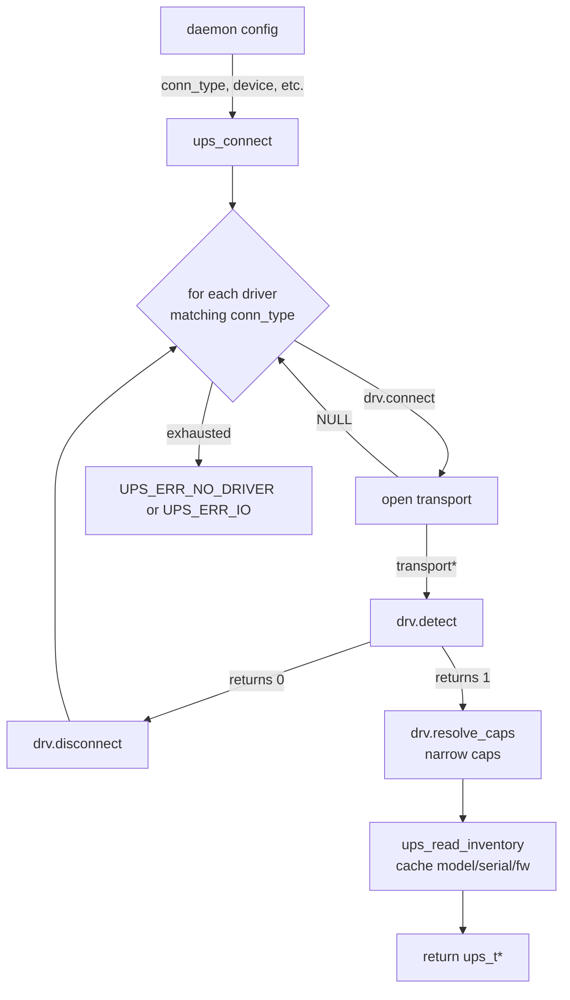
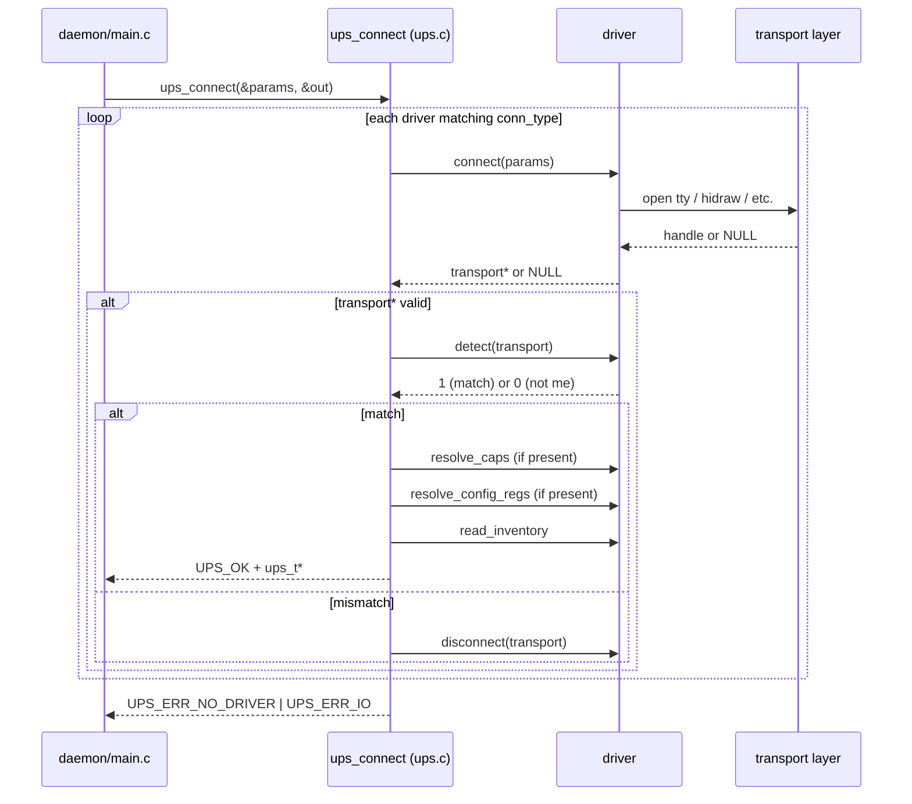
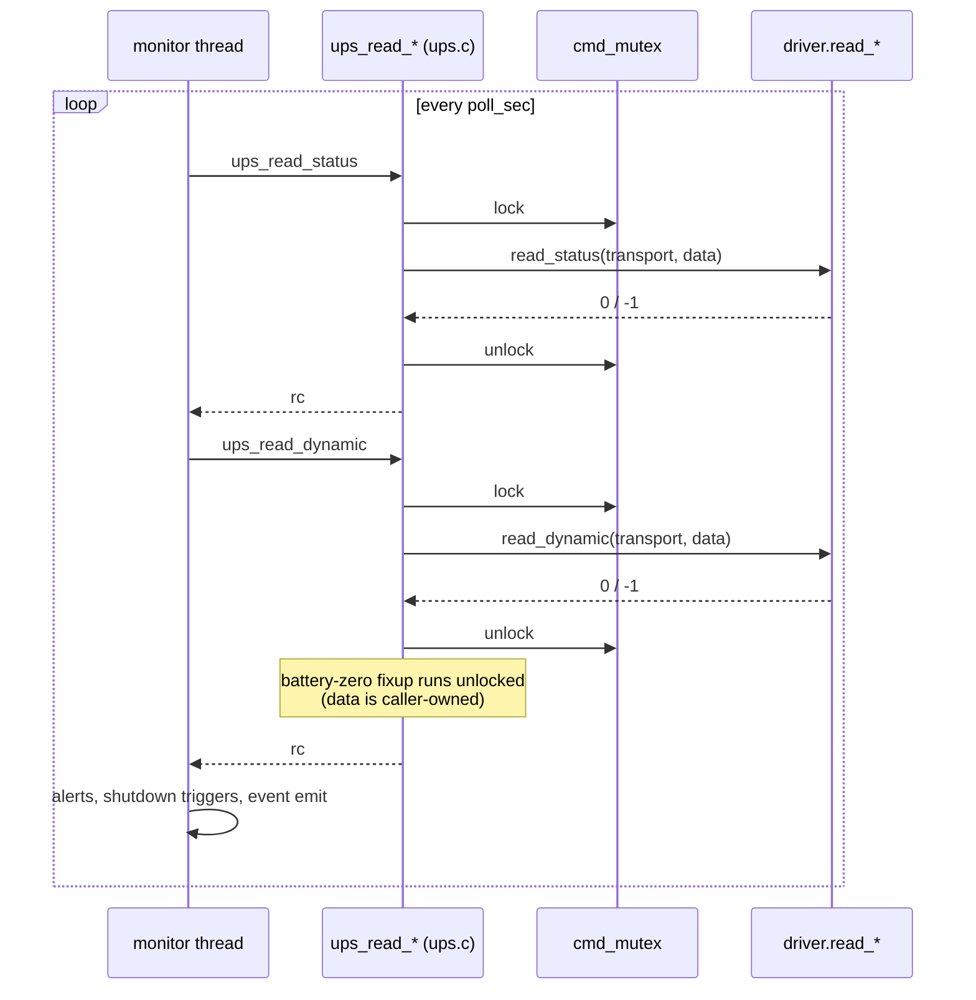
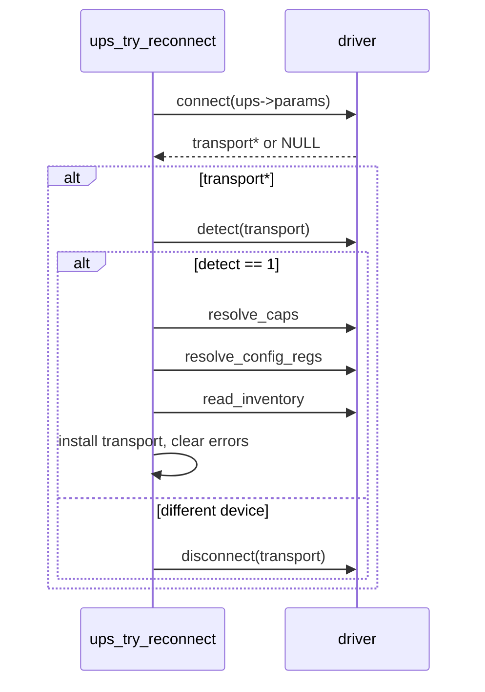

# UPS Driver API

Reference for writing and maintaining UPS drivers in **airies-ups-c**.

This document describes the contract a UPS driver implements and the public
surface every other subsystem (daemon, API routes, monitor thread, shutdown
orchestrator, alert engine, weather) sees. Code is source-of-truth: the
canonical declarations live in [`src/ups/ups_driver.h`](src/ups/ups_driver.h)
(driver-facing) and [`src/ups/ups.h`](src/ups/ups.h) (consumer-facing). This
doc exists so you can get oriented without re-reading those headers every
session.

---

## Overview

Drivers are `const ups_driver_t` instances at file scope (external linkage —
the registry in `src/ups/ups.c` references each by `extern`) listed in
`ups_drivers[]`. At runtime, the daemon calls `ups_connect(&params, &ups)`,
which iterates registered drivers whose `conn_type` matches the caller's
transport, asks each one to probe the bus, and picks the first one whose
`detect()` returns 1.



Once a driver wins the registry race:

1. The **monitor thread** begins polling `read_status` + `read_dynamic` on
   a fixed cadence (default 2 s), writing telemetry snapshots to SQLite
   every telemetry interval (default 30 s).
2. **API routes** call `ups_cmd_execute` and `ups_config_read` / `_write`
   as operator actions arrive.
3. The **alert engine** and **shutdown orchestrator** hook the monitor's
   per-poll callback to evaluate thresholds.
4. On SIGTERM/SIGINT, the daemon calls `ups_close(ups)` which invokes
   `drv.disconnect(transport)`.

The driver never knows about any of the consumers — it just implements the
vtable and returns when called.

---

## The driver struct

`ups_driver_t` is the vtable. Look at
[`src/ups/ups_driver.h`](src/ups/ups_driver.h) for field-by-field doc
comments; this section is a high-altitude reference.

| Group | Fields | Notes |
|-------|--------|-------|
| Identity | `name`, `conn_type`, `topology` | Stable ID + transport + default power-path. |
| Lifecycle | `connect(params)`, `disconnect(transport)` | Driver owns the `void *transport` handle between these two calls. |
| Identification | `detect(transport)`, `get_topology(transport)` (optional) | `detect` returns 1 iff this driver claims the device. `get_topology` overrides the static field per-connection. |
| Capabilities | `caps`, `resolve_caps(transport, default_caps)` (optional) | `caps` is the *maximum* set; `resolve_caps` narrows to what actually resolved on the live device. See [Capabilities](#capabilities). |
| Reads | `read_status`, `read_dynamic`, `read_inventory`, `read_thresholds`, `read_transfer_reason` (optional) | See [Data structs](#data-structs). Driver-level callbacks return 0 on success, -1 on I/O failure (the dispatcher remaps to `UPS_OK` / `UPS_ERR_IO`). |
| Commands | `commands[]`, `commands_count` | Descriptor-driven. See [Commands](#commands). |
| Config | `config_regs[]`, `config_regs_count`, `resolve_config_regs` (optional), `config_read`, `config_write` | Optional spec-driven setting I/O. See [Config registers](#config-registers). |
| Freq tolerance | `freq_settings[]`, `freq_settings_count` | Only meaningful when `UPS_CAP_FREQ_TOLERANCE` is claimed. |

Drivers that don't need a particular feature leave the corresponding pointer
/ count as NULL / 0. Designated initializers make this cheap; see
`ups_srt.c` (Modbus) or `ups_apc_hid.c` / `ups_cyberpower_hid.c` (USB HID
adapters layered on `hid_pdc_core.c`) for real examples.

---

## Lifecycle

### Connect (once per boot)



### Steady state (per poll)



**Lock granularity.** `ups_read_status` and `ups_read_dynamic` each take and
release `cmd_mutex` independently — they do *not* run inside one shared lock.
Other threads (API request handlers, the shutdown worker, the fast-poll
`xfer_fast_poll_thread`) can interleave between the two reads. The alert
engine and shutdown orchestrator's threshold checks run synchronously inside
the monitor thread per-poll, so they don't compete for the mutex themselves.
The `data` snapshot is caller-owned, so the battery-zero fixup that runs
after `read_dynamic` returns deliberately runs outside the lock.

### Command dispatch

API thread takes the same `cmd_mutex`, runs the driver's `execute` (or
`execute_off` for the OFF side of a toggle), sleeps 200 ms while still
holding the lock, then releases. That quiet window is part of the contract
— drivers and callers both depend on it.

### Reconnect

The registry tracks `consecutive_errors` on the `ups_t`. After five failed
reads in a row, it tears down the transport (`driver->disconnect`) and
leaves `transport = NULL`. The next `ups_read_*` call triggers
`ups_try_reconnect`, which — at most once per 2 s — walks the same
post-detect steps as the initial connect:



Driver author implication: **`connect()` must be replayable**. The registry
will call it over and over while the physical layer is down, and a
successful replay triggers another round of `detect` / `resolve_caps` /
`resolve_config_regs` / `read_inventory`. Any state the driver caches
during `connect` (e.g., the APC HID adapter's resolved standard-PDC and
vendor-page field pointers) must be recomputed each time — drivers
generally achieve this by allocating a fresh transport struct on every
`connect`.

---

## Transports

`void *transport` is opaque to the app. Each driver casts it to whatever
its library needs.

| Driver | `conn_type` | Transport handle | Lifetime |
|--------|-------------|-------------------|----------|
| `ups_srt`, `ups_smt` | `UPS_CONN_SERIAL` | `modbus_t *` (libmodbus) | `modbus_new_rtu` + `modbus_connect` in `connect`, `modbus_close` + `modbus_free` in `disconnect` |
| `ups_apc_hid`, `ups_cyberpower_hid` | `UPS_CONN_USB` | `hid_pdc_transport_t *` (defined in `hid_pdc_core.h`) | hidraw fd + parsed descriptor + standard PDC field pointers + opaque vendor-state pointer |
| *(future)* | `UPS_CONN_TCP` | TBD | Placeholder; no driver yet |
| *(future)* | `UPS_CONN_SNMP` | TBD | Placeholder; no driver yet |

### Modbus RTU (serial)

Drivers use libmodbus directly. Typical `connect` body:

```c
modbus_t *ctx = modbus_new_rtu(params->serial.device,
                               params->serial.baud, 'N', 8, 1);
if (!ctx) return NULL;
modbus_set_slave(ctx, params->serial.slave_id);
modbus_set_response_timeout(ctx, 5, 0);
if (modbus_connect(ctx) < 0) { modbus_free(ctx); return NULL; }
return ctx;
```

Reads use `modbus_read_registers(ctx, addr, count, regs)` (function 0x03,
Read Holding Registers). Writes use `modbus_write_register` /
`modbus_write_registers`.

APC quirk: some legacy SMT firmwares (pre-09.0) accept both function 3
(holding) and function 4 (input registers) for the same data. The unified
map (AN-176 and 990-9840B) is function-3-only. Stick to function 3 unless
you have a reason not to.

### USB HID

The transport handle is a `hid_pdc_transport_t` defined in `hid_pdc_core.h`,
shared by every HID PDC vendor adapter. The important bits:

- `fd`: open `/dev/hidrawN`
- `map`: parsed HID report descriptor (`hid_report_map_t`)
- `pdc`: resolved standard PDC field pointers keyed by HID usage path,
  populated by `hid_pdc_open()` at connect time
- `vendor`: opaque pointer the vendor adapter casts to its own struct
  (e.g., `apc_vendor_t` for APC's vendor-page field cache). The vendor
  owns the lifetime — allocate in `connect()`, free in `disconnect()`
  before calling `hid_pdc_close()`

Field reads use `hid_field_read_raw` / `hid_field_read_scaled` from
`hid_parser.h`. Writes use `hid_pdc_set_feature`. A field may be NULL if
the specific device didn't declare that usage in its descriptor — this is
the main reason `apc_resolve_caps()` (and its CyberPower equivalent)
exists (see [Capabilities](#capabilities)).

The shared core (`hid_pdc_core.c`) provides ready-made implementations of
`read_status`, `read_dynamic`, `read_thresholds`, and the standard PDC
commands (shutdown / abort / battery test / mute / unmute / clear faults).
Vendor adapters typically just delegate; they only override when adding
vendor-page behaviour on top.

---

## Data structs

See `ups_data_t` and `ups_inventory_t` in
[`src/ups/ups.h`](src/ups/ups.h) for per-field docs with units and
sentinels.

### `ups_data_t` — per-poll snapshot

Populated by `read_status` + `read_dynamic`. SI units throughout (volts,
amperes, Hz, seconds, percent). A few fields have meaningful sentinels:

- `timer_shutdown`, `timer_start`, `timer_reboot`: `-1` means "no countdown active"
- `efficiency`: valid only when `efficiency_reason == UPS_EFF_OK`. See
  [Efficiency encoding](#efficiency-encoding).
- Battery fields (`charge_pct`, `battery_voltage`, `runtime_sec`) are
  force-zeroed by the registry if `bat_system_error & UPS_BATERR_DISCONNECTED`
  is set.

Un-populated fields stay zero. Drivers should only write fields they
actually read.

### `ups_inventory_t` — one-shot identity

Cached on `ups->inventory` at connect time via `ups_read_inventory` and
refreshed on reconnect. Holds **identity fields only**: `model`, `sku`
(part number, separate from `model` because Back-UPS USB doesn't expose
a SKU distinct from `iProduct` — leave empty on transports that don't
have one), `serial`, `firmware`, `nominal_va`, `nominal_watts`,
`sog_config`. Consumers may use `ups->has_inventory` to gate display.

**Not here:** mutable settings like frequency tolerance, transfer
thresholds, or outlet delays. Those change at runtime and must be read
fresh via the config register API (`ups_find_config_reg` +
`ups_config_read`). Caching them in inventory would leave the UI showing
stale values after a write.

### `ups_read_thresholds` contract

Returns `transfer_high` and `transfer_low` in **volts**, not raw register
counts. Drivers must pre-scale; the `uint16_t` parameter type is legacy
(reflects APC's native storage) but the semantic is volts throughout.
Consumers can treat the result as a voltage directly.

### `read_transfer_reason` — optional fast-poll callback

A single-register read of the input transfer-reason cause register, lighter
than `read_status` (one register vs. the whole status block) so the
monitor's `xfer_fast_poll_thread` can call it every ~200 ms without
hogging the bus. Used to catch sub-poll-interval transitions: brief mains
glitches that push the UPS out of HE mode but resolve within the main 2 s
poll window — register 2 on SRT/SMT firmware reverts to "Acceptable
Input" once mains is good again, so the slow status read misses the
actual cause.

Return 0 on success, -1 on I/O failure. **Modbus-only**: leave NULL on
HID drivers, which have no separate cause register. When NULL, the
dispatcher returns `UPS_ERR_NOT_SUPPORTED` and the monitor's fast-poll
thread is not spawned.

Note that the `transfer_reason` *field* on `ups_data_t` is still part of
every driver's `read_status` output — HID drivers populate it with
`UPS_TRANSFER_REASON_UNKNOWN` (`0xFFFF`, defined in `ups_format.h`).
What's Modbus-only is the *fast-poll cause-register read*, not the
transfer-reason field itself.

### Efficiency encoding

APC reports efficiency as a signed integer (raw/128 = percent) with
negative values repurposed as reason codes (load too low, on battery, etc.).
Rather than leak that encoding everywhere, drivers split the raw into two
fields:

- `efficiency_reason` (enum `ups_eff_reason_t`): why the reading is
  available or not
- `efficiency` (double): valid percent only when
  `efficiency_reason == UPS_EFF_OK`; otherwise 0

Consumers that render or compare efficiency must check `reason == UPS_EFF_OK`
first. The shutdown orchestrator does this by returning NaN for the
comparator when reason isn't OK, so numeric triggers silently skip.

---

## Capabilities

Capability flags gate feature surface — UI buttons, API responses, the
shutdown orchestrator's target search. A capability is *honest* when
claiming it guarantees the feature will actually work against the live
device.

Each driver declares a **maximum** set in `driver->caps`. At connect
time, the registry calls `driver->resolve_caps(transport, driver->caps)` if
present, letting the driver clear bits for features that didn't resolve
against this specific device. The returned mask is stored on `ups_t->caps`,
and every `ups_has_cap()` query reads from there.

Example (APC HID):

```c
static uint32_t apc_resolve_caps(void *transport, uint32_t default_caps)
{
    hid_pdc_transport_t *t = transport;
    const apc_vendor_t  *v = t->vendor;
    uint32_t caps = default_caps;

    /* Casts pacify -Wsign-conversion (a project-wide flag); without them
     * `caps &= ~UPS_CAP_SHUTDOWN` is a build error since the enum value
     * promotes to int and `~` produces a signed result. */
    if (!t->pdc.delay_before_shutdown) caps &= (uint32_t)~UPS_CAP_SHUTDOWN;
    if (!t->pdc.test)                  caps &= (uint32_t)~UPS_CAP_BATTERY_TEST;
    if (!t->pdc.module_reset)          caps &= (uint32_t)~UPS_CAP_CLEAR_FAULTS;
    if (!t->pdc.alarm_control)         caps &= (uint32_t)~UPS_CAP_MUTE;
    if (!v || !v->lights_test)         caps &= (uint32_t)~UPS_CAP_BEEP;
    return caps;
}
```

If a driver doesn't need to narrow (e.g., the SRT always supports
everything it advertises), just leave `resolve_caps = NULL`.

### Claimed capability ↔ obligation

| Capability | Obligation |
|------------|------------|
| `UPS_CAP_SHUTDOWN` | A command in `commands[]` with `UPS_CMD_IS_SHUTDOWN` set in `flags`. |
| `UPS_CAP_BATTERY_TEST` | A command named "battery_test" (or equivalent). |
| `UPS_CAP_RUNTIME_CAL` | Commands for start/stop of runtime calibration. |
| `UPS_CAP_CLEAR_FAULTS` | A command that resets latched fault indicators. |
| `UPS_CAP_MUTE` | A command with `UPS_CMD_IS_MUTE` set. |
| `UPS_CAP_BEEP` | A short-beep-test command. |
| `UPS_CAP_BYPASS` | A toggle command (see [Commands](#commands)) whose `status_bit` reflects `UPS_ST_BYPASS`. |
| `UPS_CAP_FREQ_TOLERANCE` | `freq_settings[]` populated with at least one option. |
| `UPS_CAP_HE_MODE` | `ups_data.status` reflects `UPS_ST_HE_MODE` correctly. |

---

## Config registers

Descriptor-driven, driver-supplied table of readable/writable UPS settings.
Each driver provides a `config_regs[]` array; the daemon exposes the entries
via `/api/config/ups` (settings page) and `/api/about` (full register dump)
without knowing the register layout of each family. Operators read and
write through the same API on every driver — only the descriptors and the
driver-side `config_read` / `config_write` translators change.

### The descriptor

`ups_config_reg_t` (full definition in `src/ups/ups_driver.h`):

| Field | Purpose |
|-------|---------|
| `name` | API dispatch key (e.g. `"transfer_high"`). |
| `display_name` | Human label for the UI (e.g. `"High Transfer Voltage"`). |
| `unit` | `"V"`, `"s"`, `"%"`, or `NULL`. UI suffix only — the wire is unitless. |
| `group` | UI grouping bucket (`"transfer"`, `"delays"`, etc.). |
| `reg_addr` | Driver-interpreted: Modbus drivers store an absolute register address; HID adapters store a **field index into `map->fields[]`** (populated at connect by the fixup function, see below). |
| `reg_count` | Register span: 1 for `uint16`, 2 for `uint32` (Modbus packs MSB first), `N` for an `N`-register STRING. |
| `type` | One of `UPS_CFG_SCALAR`, `UPS_CFG_BITFIELD`, `UPS_CFG_STRING`, `UPS_CFG_FLAGS`. |
| `scale` | Display divisor; `1` = raw. |
| `writable` | Non-zero if the driver's `config_write` accepts this descriptor. The dispatcher rejects writes against `writable == 0` with `UPS_ERR_NOT_SUPPORTED` before the driver sees them. |
| `meta` | Type-specific union; see [Validation contract](#validation-contract) below. |
| `category` | One of `UPS_REG_CATEGORY_CONFIG` (default), `MEASUREMENT`, `IDENTITY`, `DIAGNOSTIC`. `/api/config/ups` filters to `CONFIG`; the others surface only via `/api/about`. Default-zero (CONFIG) means existing entries don't need annotation, but new tunables/diagnostics should be tagged explicitly. |
| `has_sentinel`, `sentinel_value` | When `has_sentinel == 1` and the read raw value equals `sentinel_value`, the API renders the field as N/A instead of a number (e.g., a "no battery installed" indicator a UPS reports as `0xFFFF`). |

### Type cheat-sheet

| `type` | Wire shape | Meta access | Example |
|--------|------------|-------------|---------|
| `UPS_CFG_SCALAR` | unsigned integer (`reg_count`-wide) | `meta.scalar.{min, max, step}` | High Transfer Voltage (volts, scalar). |
| `UPS_CFG_BITFIELD` | one-of-N enum: each `opts[]` entry's `value` is a complete acceptable register value (single-bit, or arbitrary integer — driver picks the encoding) | `meta.bitfield.{opts, count, strict}` | Audible Alarm = Disabled / Enabled / Muted; SRT bat_test = OnStartUp / OnStartUpPlus7 / ... |
| `UPS_CFG_STRING` | `reg_count` registers, two ASCII chars per register | `meta.string.max_chars` | Output Voltage Selector free-text (rare). |
| `UPS_CFG_FLAGS` | multi-bit register where every set bit is a separately-named flag | `meta.bitfield.{opts, count, strict}` (shares the bitfield branch) | UPSStatus / PowerSystemError diagnostic dumps. Each `opts[]` entry's `value` is a single bit mask; the decoder ORs the set bits and renders the matching labels as a list. |

### Validation contract

`ups_config_write` validates the value against `meta` *before* invoking the
driver. Failures return `UPS_ERR_INVALID_VALUE` and the driver never sees
the value.

- **SCALAR.** `min ≤ value ≤ max` when set. Convention: `min == 0 && max == 0`
  means "no range declared" — the check is skipped. `step` is a UI-only
  hint (rendered as `<input step=N>`); the wire still accepts any in-range
  integer.
- **BITFIELD.** When `meta.bitfield.strict == 1`, the value must equal one
  of the entries in `opts[]`; otherwise the dispatcher rejects it. With
  `strict == 0`, any value passes through to the driver — use sparingly,
  only when the firmware accepts arbitrary combinations or you need a
  raw-bypass escape hatch.
- **STRING.** `max_chars` is enforced by the string-write path.
- **FLAGS.** Currently passthrough (the flags-typed descriptors that exist
  today are read-only diagnostics). When a writable FLAGS descriptor lands,
  validation should ensure the value covers only declared bits.

The "rapid-fire writes confuse APC firmware" reflex (see
`docs/reference/apc-srt-modbus.md`) is one reason this gate exists in the
dispatcher rather than in each driver: an out-of-range write rejected at
the dispatcher never gets the chance to wedge the control plane.

### HID adapter pattern: in-place fixup

HID adapters' `config_regs[]` are declared **mutable** (`static
ups_config_reg_t`, NOT `const`) because the resolver writes the resolved
HID field index into each entry's `reg_addr` at connect time. Modbus
drivers use `static const` — `reg_addr` is a literal Modbus register
address known at compile time and never changes.

The fixup function calls `hid_pdc_fixup_config_reg(reg, field, map)` for
each (descriptor, resolved-field) pair; that helper writes the field
index into `reg->reg_addr` (and copies the field's logical min/max into
`meta.scalar` for scalars). At read/write time, the adapter resolves the
field via `hid_pdc_field_by_index(map, reg->reg_addr)` and delegates the
actual I/O to `hid_pdc_config_read_field` / `hid_pdc_config_write_field`
in the shared core.

### Narrowing at connect time: `resolve_config_regs`

Analogous to `resolve_caps`. The driver's `config_regs[]` is the
maximum set; `resolve_config_regs(transport, default_regs, default_count,
out)` lets the driver narrow to descriptors whose backing register / HID
field actually resolved on the live device. The registry allocates `out`
with capacity `default_count`, the driver writes the subset as struct
copies, and the result is cached on `ups_t->resolved_regs`.
`ups_get_config_regs` returns the narrowed set when present and the full
static array otherwise.

The APC and CyberPower HID adapters use this to drop descriptors whose
HID field didn't resolve on the current device. The fixup call comes
*first* — the dispatcher guarantees `resolve_config_regs` runs on every
connect AND reconnect, so this is the right place to refresh field
indices any time the transport comes back up:

```c
static size_t apc_resolve_config_regs(
    void *transport, const ups_config_reg_t *default_regs,
    size_t default_count, ups_config_reg_t *out)
{
    hid_pdc_transport_t *t = transport;
    (void)default_count;

    apc_fixup_config_regs(t);   /* populate reg_addr with field indices */

    size_t n = 0;
    #define KEEP_IF(idx, f) do { if ((f)) out[n++] = default_regs[(idx)]; } while (0)
    KEEP_IF(CFG_TRANSFER_LOW, t->pdc.transfer_low);
    // ...one line per descriptor index
    #undef KEEP_IF
    return n;
}
```

Drivers that don't need narrowing (SRT, currently) leave
`resolve_config_regs = NULL` and consumers see the static array. SMT uses
this to drop SOG descriptors for outlet groups that aren't physically
present on the SKU.

### Where the examples live

- Modbus, `static const` table + direct register I/O —
  `src/ups/ups_srt.c:srt_config_regs` plus `srt_config_read` /
  `srt_config_write`.
- HID, mutable table + fixup + delegation to the shared core —
  `src/ups/ups_apc_hid.c:apc_config_regs` plus
  `apc_fixup_config_regs` and `apc_resolve_config_regs`.

---

## Commands

Drivers declare operator actions in `commands[]`, each a `ups_cmd_desc_t`:

- `name` (API dispatch key), `display_name`, `description`, `group`
- `confirm_title` / `confirm_body` — optional modal text
- `type`: `UPS_CMD_SIMPLE` (one handler) or `UPS_CMD_TOGGLE` (on + off)
- `variant`: visual weight (`DEFAULT`, `WARN`, `DANGER`)
- `flags`: feature bits (`UPS_CMD_IS_SHUTDOWN`, `UPS_CMD_IS_MUTE`)
- `status_bit`: for toggles, which `ups_data.status` bit reflects the
  "on" state
- `execute(transport)`, `execute_off(transport)` handlers

Handlers run under `cmd_mutex` with a guaranteed 200 ms quiet window after
return. Return 0 on success, -1 on error.

---

## Frequency tolerance

`freq_settings[]` enumerates the valid frequency-tolerance choices a UPS
accepts (e.g. `60 Hz ± 0.1 Hz`, `60 Hz ± 1.0 Hz`, ...). Each entry holds
the raw register value, an API name, and a human label. Only consumed
when `UPS_CAP_FREQ_TOLERANCE` is in the effective capability set —
`ups_get_freq_settings` and friends return NULL for drivers that don't
claim it. Drivers that *do* claim it must populate at least one entry.

---

## Error conventions

| Code | Meaning |
|------|---------|
| `UPS_OK` (0) | Success |
| `UPS_ERR_IO` (-1) | I/O failure: transport down, CRC error, driver returned -1 |
| `UPS_ERR_NO_DRIVER` (-2) | No registered driver identified the UPS |
| `UPS_ERR_NOT_SUPPORTED` (-3) | The active driver lacks the requested callback (or `reg->writable == 0` on a `ups_config_write`) |
| `UPS_ERR_INVALID_VALUE` (-4) | A `ups_config_write` failed validation against the descriptor's meta — out-of-range SCALAR, or a value not in `opts[]` for a strict BITFIELD. The driver never sees the value. API routes should map this to HTTP 400 (operator error), distinct from `UPS_ERR_IO`'s 5xx (hardware error). |

All negative, so `if (rc < 0)` catches every failure. Driver-level
callbacks return 0 / -1 only; the registry translates to the public-API
codes above.

There is no errno-style thread-local error message buffer; callers log
failures at the call site. The registry tracks
`ups->consecutive_errors` and tears down the transport after 5 consecutive
read failures, rate-limiting reconnect attempts to one every ~2 seconds.

---

## Threading

**The registry serializes all driver access via `ups->cmd_mutex`.** Every
`ups_read_*`, `ups_cmd_execute`, and `ups_config_*` acquires that mutex,
calls the driver, and releases. Consequences:

- Driver callbacks run single-threaded as far as `transport` is concerned.
- Drivers MUST NOT spawn threads that touch `transport`. If the driver
  needs internal asynchrony, it must serialize itself.
- Concurrent callers (monitor thread, the fast-poll
  `xfer_fast_poll_thread` for `read_transfer_reason`, libmicrohttpd-managed
  API request handlers, shutdown worker thread) will stall each other if
  one is blocked in a slow I/O. In practice Modbus reads finish in under
  ~100 ms, so contention is invisible, but it's a real cost when one read
  hangs waiting for timeout.
- After every successful command execute or config_write, the registry
  sleeps 200 ms *before* releasing the mutex. Drivers can rely on that
  quiet window for UPS firmware to process the write before the next
  read races in.

The inventory cache (`ups->inventory`) is written at connect time and
**rewritten on every successful reconnect** (a freshly-replaced UPS of the
same family may report different model/serial/firmware). `has_inventory`
is the guard for whether it's been populated at all. Writes happen with
`cmd_mutex` held (reconnect runs from inside a dispatcher's lock); reads
by display consumers (monitor's session-banner copy, `/api/about` route)
do **not** take the lock and accept the resulting tradeoff: a struct copy
that races with a reconnect may yield a stale or briefly-torn snapshot.
This is acceptable because the fields are display-only and char arrays
are NUL-terminated, so the worst case is a one-poll-old model name on
the dashboard.

---

## Testing

Each test binary links against `src/ups/ups.c`, which references
`extern const ups_driver_t ups_driver_srt / _smt / _apc_hid /
_cyberpower_hid`. To satisfy the linker without pulling in real driver
code and the libraries they need (libmodbus, hidraw open paths),
`tests/test_stubs.c` declares each driver as a minimal empty
`ups_driver_t`:

```c
const ups_driver_t ups_driver_srt = {
    .name = "srt_stub", .conn_type = UPS_CONN_SERIAL,
    .topology = UPS_TOPO_ONLINE_DOUBLE, .caps = 0,
};
```

Designated initializers zero-init all other fields, including function
pointers — which is safe because the registry NULL-checks every callback.

For driver-specific logic (e.g., string formatting, register decoding),
tests invoke the helpers directly without going through the registry.
See `tests/test_ups_strings.c` for the pattern.

---

## New-driver checklist

Adding a new driver (e.g., an SNMP or Modbus TCP driver):

1. **Files** — create `src/ups/ups_<family>.c`. Header-in-c file; no
   separate `.h` unless the driver exposes helpers to other translation
   units (rare). For a USB HID PDC family, layer on `hid_pdc_core` and
   model the file on `ups_cyberpower_hid.c` (minimal) or `ups_apc_hid.c`
   (with vendor-page extensions).
2. **Driver struct** — `const ups_driver_t ups_driver_<family>` at the bottom
   of the file, with every required callback pointing at a file-scope static
   function. **Not `static`** — `ups.c` references each driver via an
   `extern` declaration, so the symbol must have external linkage.
3. **Connect / disconnect** — own the `void *transport` lifetime. Must be
   re-entrant-safe; the registry calls speculatively across drivers.
4. **Detect** — cheap probe (one or two reads); return 1 if you recognize
   the device. Keep this small; it runs on every connect candidate.
5. **Resolve caps** (if needed) — narrow the maximum-cap mask based on
   what resolved against the live device. See APC example above.
6. **Reads** — `read_status`, `read_dynamic`, `read_inventory`,
   `read_thresholds`, and (Modbus-only, optional) `read_transfer_reason`.
   Populate the relevant `ups_data_t` / `ups_inventory_t` fields and
   leave the rest zeroed. Remember `read_thresholds` returns **volts**,
   not raw register counts, and `ups_inventory_t` is identity-only (no
   mutable settings). Leave `read_transfer_reason = NULL` on HID
   drivers (no separate cause register exists).
7. **Commands & config regs** — file-scope tables + handler functions.
   Match each claimed capability to a command per the table in
   [Capabilities](#capabilities). For Modbus drivers, declare config_regs
   as `static const` (the `reg_addr` field is the literal Modbus address,
   set at compile time). For HID adapters, declare config_regs as
   `static` *without* `const` — the resolver writes the resolved HID
   field index into each `reg_addr` at connect time via
   `hid_pdc_fixup_config_reg()`. If some descriptors are only present
   on a subset of devices in your family, implement
   `resolve_config_regs` to narrow at connect time (parallel to
   `resolve_caps`); see [Config registers](#config-registers).
8. **Register in `src/ups/ups.c`** — add `extern const ups_driver_t
   ups_driver_<family>;` and an entry in `ups_drivers[]`. Order matters:
   put specific drivers before permissive ones to avoid misclassification.
9. **Stub in `tests/test_stubs.c`** — add the empty `const
   ups_driver_t ups_driver_<family>` stub so tests link.
10. **Makefile** — append the new source file to `UPS_SRCS` in the top-level
    `Makefile`. (The build doesn't auto-discover by glob.)
11. **Build & test** — `make clean && make debug && make test`. All
    warnings are errors; the project uses strict flags.
12. **Smoke-test against real hardware** — run `./airies-upsd` against
    the actual UPS, watch `stdout.log`, verify detect and steady-state
    reads. See the [README](README.md) §Development for the local build flow.

---

## Known rough edges

Not blocking, but worth fixing when someone has the cycles:

- **HID PDC output-voltage inference** in `hid_pdc_read_dynamic_standard`
  is derived from `status & ON_BATTERY ? nominal : input_voltage`.
  Accurate for standby/line-interactive UPS but not perfect during
  transitional states.
- **HID PDC standard descriptor metadata is duplicated** between
  `apc_config_regs` and `cyberpower_config_regs`. Roughly 20 entries are
  identical static initializer text. Acceptable while there are only two
  HID vendor adapters; revisit if a third lands.
- **Modbus TCP / SNMP are placeholder enums**. `ups_connect` will return
  `UPS_ERR_NO_DRIVER` for either until a driver lands.

---

## References

- [`src/ups/ups_driver.h`](src/ups/ups_driver.h) — driver vtable, detailed
  field-by-field comments
- [`src/ups/ups.h`](src/ups/ups.h) — consumer-facing API, status bits,
  error codes, data structs
- [`src/ups/ups.c`](src/ups/ups.c) — registry, connect, mutex-wrapped
  callback dispatch
- [`docs/vendor/apc/990-9840_modbus_register_map.pdf`](docs/vendor/apc/990-9840_modbus_register_map.pdf)
  — unified SMT/SMX/SURTD/SRT register map (APC)
- [`docs/vendor/apc/AN176_modbus_implementation.pdf`](docs/vendor/apc/AN176_modbus_implementation.pdf)
  — protocol-level spec (framing, BPI encoding, register-block layout)
- [`docs/reference/apc-smt-modbus.md`](docs/reference/apc-smt-modbus.md),
  [`docs/reference/apc-srt-modbus.md`](docs/reference/apc-srt-modbus.md)
  — our own notes on register quirks and firmware behaviour
